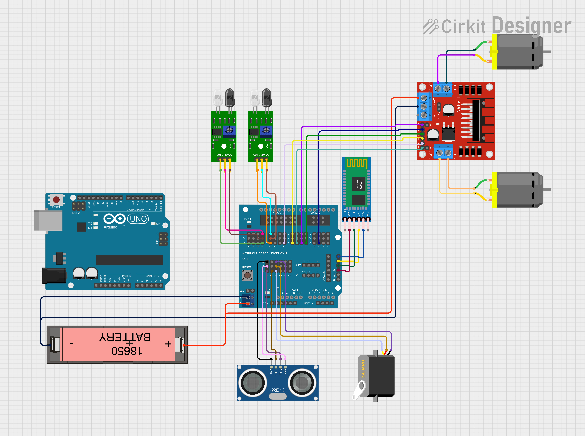

# CS179J - Autonomous Path Finding Vehicle

##### Project Group ERASER: Eric Choi, Artip Nakchinda, Sean Yi
This project is about two autonomous RC cars working together to find an exit out of a maze. Final project for Senior Project course.

# Parts
- 2x Arduino Uno (or any other Arduino)
- 2x 2WD chassis
- 2x L298N Motor Driver
- 2x Servo Motor
- 2x HC-SR04 Ultrasonic Sensor
- 4x Obstacle Avoidance Sensor
- 2x Bluetooth Module (or any other wireless communication module)
- 2x 18650 Battery Holder
- 4x 18650 Battery

# Installation
- Install [Arduino IDE](https://www.arduino.cc/)
- Download [Lafvintech Arduino Obstacle Avoidance Car Kit V1.1](https://www.dropbox.com/sh/a9449isour59wxb/AABICqcGMIcvmcbBOA_38-Tsa?e=7&dl=0) zip file
- Add library to Arduino IDE
  - Open Arduino IDE
  - Go to `Sketch` -> `Include Library` -> `Add .ZIP Library...`
  - Select `LafvinCarKitV1.1.zip` from the zip file
- Extract the zip file to access the example code
- Open `autoMaze.ino` in Arduino IDE
- Connect the Arduino to PC
- Upload the code to the Arduino

# Usage
- Open `autoMaze.ino` in Arduino IDE
- Connect the Arduino to the computer
- Upload the code to the Arduino
- Connect the Arduino to the car
- Turn on the car
- Place the car in the maze
- Watch the car navigate through the maze

# Circuit Diagram

This is the circuit diagram for one of our autonomous RC vehicles.

# Code
- The main vehicle software is located in the `mainCode` folder.
- The `refCode` folder contains code from different sources
  - This also includes some original/modified code to understand how each component works better.
- You can load any of the code into the Arduino to test components, or load the main code to see all of it working together.

# References
- [Arduino](https://www.arduino.cc/)
- [Lafvintech Tutorials](https://lafvintech.com/pages/tutorials)
- [Lafvintech Arduino Obstacle Avoidance Car Kit V1.1](https://www.dropbox.com/sh/a9449isour59wxb/AABICqcGMIcvmcbBOA_38-Tsa?e=7&dl=0)
- [Arduino Get Started: Obstacle Avoidance Sensor](https://arduinogetstarted.com/tutorials/arduino-infrared-obstacle-avoidance-sensor)

# Other Notes
- The refCode directory contains example code from the zip file. It is not used in the project
